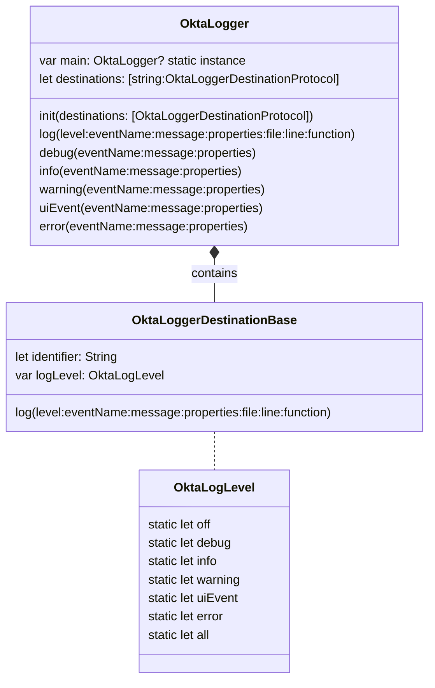
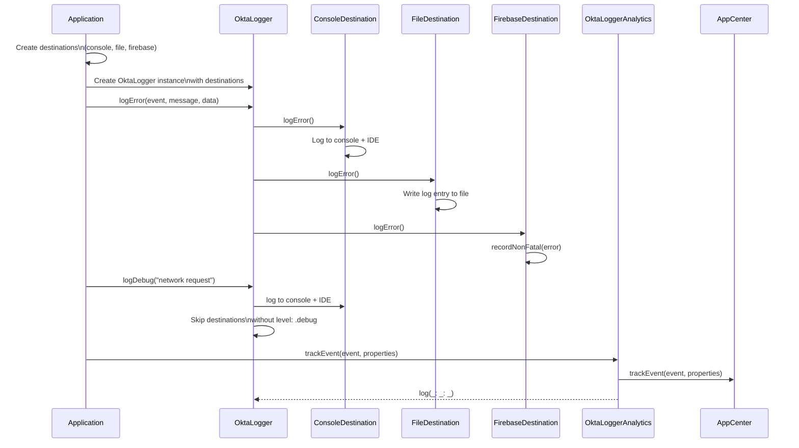

# OktaLogger

OktaLogger is a proxy-based logging SDK for allowing an app to log to many destinations at once, allowing for easy error and metric reporting without extraneous noise.

1. Compatible with Swift and Objective-C;
2. Supports single input to multiple output logger classes (e.g. console, firebase, filesystem);
3. Supports runtime log level changes to any destination;
4. Supports changing destinations at runtime;
5. Default properties for logging destinations in order to support data such as device identifier.

#### Table of contents

- [Getting started](#getting-started)
    - [CocoaPods](#cocoapods)
    - [Swift Package Manager](#spm)
- [Usage](#usage)
- [Destinations](#destinations)
  - [Console](#console-destination)
  - [File](#file-destination)
  - [Firebase Crashlytics](#firebase-crashlytics-destination)
  - [Instabug](#instabug-destination)
  - [Custom destinations](#custom-destinations)
- [OktaAnalytics](#oktaanalytics)
- [Log levels](#log-levels)
- [Diagrams](#diagrams)

## Getting started

### CocoaPods

This SDK is available through [CocoaPods](https://cocoapods.org). To install it, add the following line to your Podfile:

```
pod 'OktaLogger', :git => 'https://github.com/okta/okta-logger-swift.git'
```

There are few available subspecs:

- `Core` - Contains only basic functionality and Console logger destination;
- `FileLogger` - Core + File logger destination;
- `FirebaseCrashlytics` - Core + Firebase Crashlytics logger destination;
- `Complete` - Includes all available functionality. This subspec will be used by default.

### Swift Package manager

This SDK is available through Swift Package Manager. To install it, import it from the following url:
```
https://github.com/okta/okta-logger-swift.git
```
There are few available products available to import:

- `OktaLoggerCore` - Contains only basic functionality and Console logger destination;
- `OktaFileLogger` - Core + File logger destination;
- `OktaFirebaseCrashlytics` - Core + Firebase Crashlytics logger destination;
- `OktaInstabugLogger` - Core + Instabug logger destination;
- `OktaLogger` - Includes all available functionality;

## Usage

To start using OktaLogger you need to initialize `OktaLogger` object. Initializer takes `destinations` array as parameter, so you can specify which destinations your logger will use. Please note that each destination should have unique identifier. New destination with existing ID won't be added. You can find more information about logging destinations in the [related section](#destinations).

```swift
    // Initialization
    let consoleDestination = OktaLoggerConsoleLogger(
        identifier: "com.okta.consoleLogger",
        level: .all,
        defaultProperties: nil
    )
    let logger = OktaLogger(destinations: [consoleDestination])
```

After initialization `OktaLogger` object is ready to track events:

```swift
    // Logging
    logger.info(eventName: "Start enrollment", message: nil)
    logger.error(eventName: "TOTP Failure", message: "Could not retrieve key for RSA Key: ab43csd")
```

To add or remove destinations use `addDestination(_:)` and `removeDestination(withIdentifier:)` methods of `OktaLogger` instance:

```swift
    // Edit destinations
    let firebaseDestination = OktaFirebaseDestination(
        crashlytics: Crashlytics.crashlytics(),
        identifier: "com.okta.firebaseLogger",
        level: .error
    )
    logger.addDestination(firebaseDestination)
    logger.removeDestination(withIdentifier: consoleDestination.identifier)
```

Use `setLogLevel(level:, identifiers:)` method to change log level of any destination(s):

```swift
    // Changing log levels
    logger.setLogLevel(level: [.warn, .error], identifiers: [console.identifier, firebase.identifier])
```

## Destinations

Destination is an entity which perform log operation according to its implementation. Destinations should conforms to `OktaLoggerDestinationProtocol`. There are 3 default destinations which provided by OktaLogger SDK:

1. [Console (OktaLoggerConsoleLogger)](#console-destination)
2. [File (OktaLoggerFileLogger)](#file-destination)
3. [Firebase (OktaLoggerFirebaseCrashlyticsLogger)](#firebase-crashlytics-destination)
4. [AppCenter (AppCenterLogger)](#app-center-destination)

All of the default logging destinations are thread-safe and could be used from any thread.

Destination instance has an ID string to store and identify it in the `OktaLogger`. You can use any format for identifier. We recommend to use reverse-domain format with app Bundle ID and destination name in it.

Each destination has its own log level that specifies which messages should be processed by it. Please, refer to [related section](#log-levels) to find out more about log levels.

Each destination also has `defaultProperties` parameter. This is key-value structure that could be used for storing some general information like user ID, app version, etc. Default destinations including string representation of this structure in the every log message. You can modify default properties with `addDefaultProperties(_:)` and `removeDefaultProperties(for:)` methods.

### Console destination

Related class - [OktaLoggerConsoleLogger](OktaLogger/OktaLoggerConsoleLogger.swift).  
This destination is using `os_log` function to print log messages to the console. It does not contain any 3rd party dependencies and mainly used during the XCode debug sessions.

### File destination

Related class - [OktaLoggerFileLogger](OktaLogger/FileLoggers/OktaLoggerFileLogger.swift).  
The purpose of this destination is storing logs on the disk.  
There are several features available:

- Writing logs to filesystem in the specified location;
- Configure amount of logs that should be collected and the rolling policy (see [OktaLoggerFileLoggerConfig](OktaLogger/FileLoggers/OktaLoggerFileLoggerConfig.swift));
- Retrieve log data and log files paths;
- Purge existing logs.

File logging destination is using [CocoaLumberjack](https://github.com/CocoaLumberjack/CocoaLumberjack) for logging implementation.

### Firebase Crashlytics destination

Related class - [OktaLoggerFirebaseCrashlyticsLogger](OktaLogger/FirebaseCrashlyticsLogger/OktaLoggerFirebaseCrashlyticsLogger.swift).  
This destination is using FirebaseCrashlytics SDK to log messages, so they can be accessed from Firebase console.  
There are few important features and restrictions in this destination:

- To initialize it you need to [setup and initialize Firebase SDK](https://firebase.google.com/docs/ios/setup) first. After that, you can pass configured `Crashlytics` object to the destination initializer.
- Logs with `warning` and `error` levels are sent as [non-fatal events](https://firebase.google.com/docs/crashlytics/customize-crash-reports#log-excepts). These logs are also added to non-fatal and fatal error reports.
- Logs with `debug`, `info` and `uiEvent` are added as [custom log messages](https://firebase.google.com/docs/crashlytics/customize-crash-reports#add-logs). These logs can be accessible only in scope of fatal or non-fatal errors.
- Error name in Firebase event consist of destination id and lowercased event name in the following format: `<destination id>.<event name>`. For example, "Push register failed" error event has `okta.verify.crashlytics.logger.push-register-failed` error name.
- Maximum amount of logs that could be added to one report is restricted by 64kB on SDK level.
- Fatal and non-fatal error reports is sent on the next app launch.

This destination is using [Firebase Crashlytics SDK](https://github.com/firebase/firebase-ios-sdk) for logging implementation.

### Instabug destination

Related class -
[OktaLoggerInstabugLogger](OktaLogger/InstabugLogger/OktaLoggerInstabugLogger.swift).  
This destination uses the Instabug SDK to send events, so they can be accessed from the Instabug console in bug report or improvement suggestion.
There are a few important features and restrictions in this destination:

- Logger will not send events unless Instabug is configured [setup Instabug in iOS app](https://docs.instabug.com/docs/ios-integration).
- You can review only 1000 log records for one report. See [Instabug docs](https://docs.instabug.com/docs/ios-integration) for more details.
- For each log level OktaLogger will call appropriate Instabug log method. See the full list in the table below.

| OktaLogger log level | Instabug log method   |
| -------------------- | --------------------- |
| `all`                | `IBGLog.logVerbose()` |
| `debug`              | `IBGLog.logDebug()`   |
| `info`               | `IBGLog.logInfo()`    |
| `uiEvent`            | `IBGLog.logInfo()`    |
| `warning`            | `IBGLog.logWarn()`    |
| `error`              | `IBGLog.logError()`   |

This destination is using [Instabug iOS SDK](https://github.com/Instabug/Instabug-iOS) for logging implementation.

### Custom destinations

If you want to create your custom destination it is recommended to inherit it from `OktaLoggerDestinationBase` class, as this class implements some basic functionality. Hovewer, the only requirement for destinations is to conform to `OktaLoggerDestinationProtocol`.

If you choose to inherit from `OktaLoggerDestinationBase`, than you need to implement `log()` method in order to make it work. You can use `stringValue()` method to receive default log message string representation. Please, refer to [OktaLoggerConsoleLogger](OktaLogger/OktaLoggerConsoleLogger.swift) as an example of logger destination implementation.

## OktaAnalytics


`OktaAnalytics` is a pod that's useful to track `Analytics`, right now we are supporting `AppCenter` and dependent on `OktaLogger` framework.
  OktaAnalytics has functions to add, remove, purge providers and trackevent functions.
 Steps to use `OktaAnalytics` 
 -  Client have to implement `AnalyticsProviderProtocol` and provide information about provider (or) use create `AppCenterAnalyticsProvider` instance by providing `AppCenterAnalytics.Analytics.Type` with `init`
    if client is implementing `AnalyticsProviderProtocol` protocol, `func trackEvent(_ eventName: String, withProperties: [String: String]?)` has to be overridden and add tracking event calls of provider by the client.
 - If client use `AppCenterAnalyticsProvider`, needs to register/start services using `start(withAppSecret appSecret:, services:)`
 - Add `AnalyticsProviderProtocol` type instance to `OktaAnalytics` using `addProvider(_: provider)` function 
    ```swift
     OktaAnalytics.addProvider(appCenterAnalyticsProvider)
    ```
 - Now the provider is added to `OktaAnalytics` and user can track the events using `trackEvent(eventName:, withProperties:)` to track events to the provider.

## Log levels

OktaLogger provides 7 log levels:

- `off`
- `error`
- `uiEvent`
- `warning`
- `info`
- `debug`
- `all`

Every destination has its own level, so you can change it separately for each of them. Logging destinations will only log events which match against their level(s).

For example, the following console logger will ignore `debug` logs, but will process logs with level `info`, `warning` and `error`:

```swift
let consoleLogger = OktaLoggerConsoleLogger(identifier: "console.logger", level: [.info, .warn, .error])`
let logger = OktaLogger(destinations: [consoleLogger])
```

Logging level can be changed at runtime using `setLogLevel(level:, identifiers:)` method of `OktaLogger` or by changing `level` property in `OktaLoggerDestination` instance.

```swift
logger.setLogLevel(level: .all, destinations: [consoleLogger.identifier])
// or
consoleLogger.level = .all
```

## Diagrams



